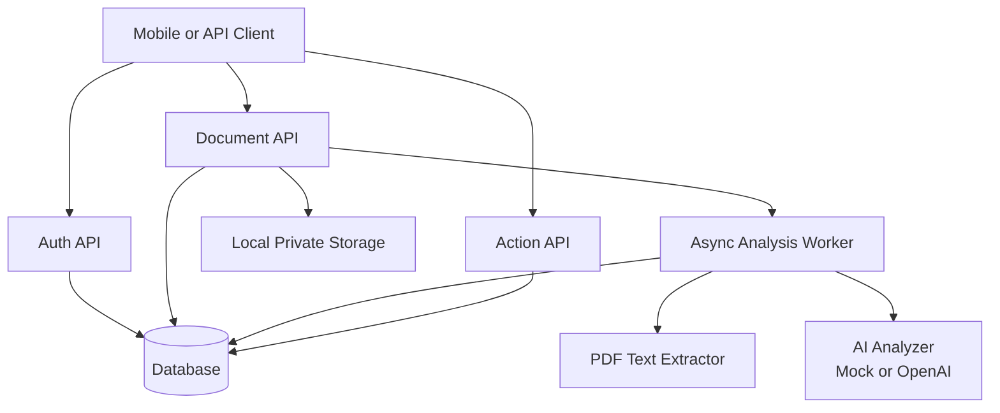
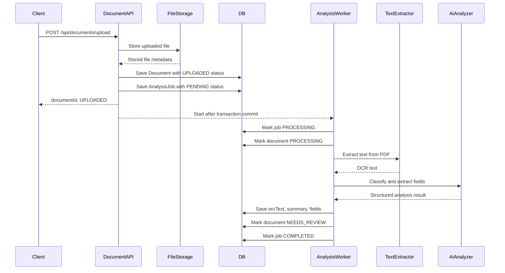
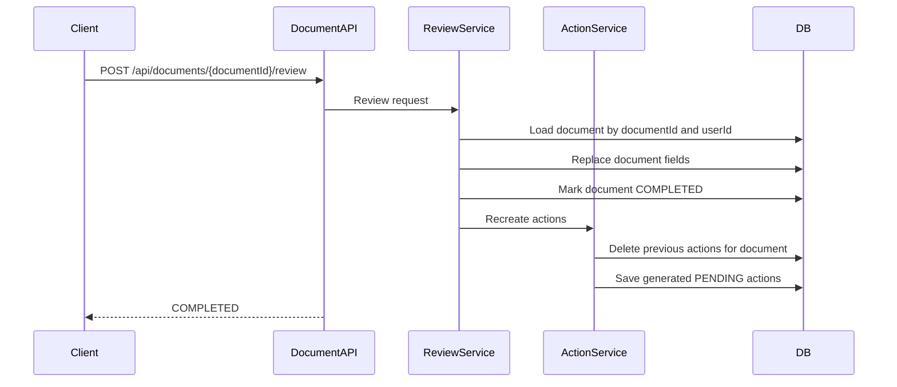
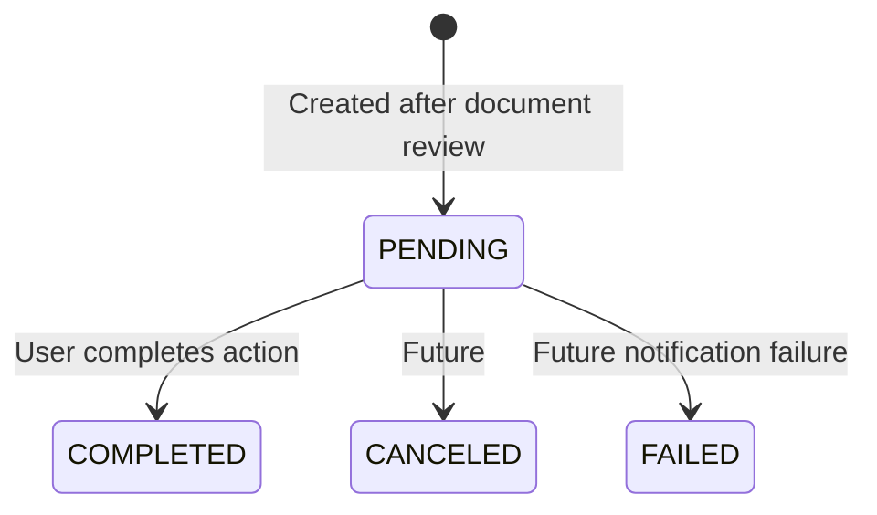
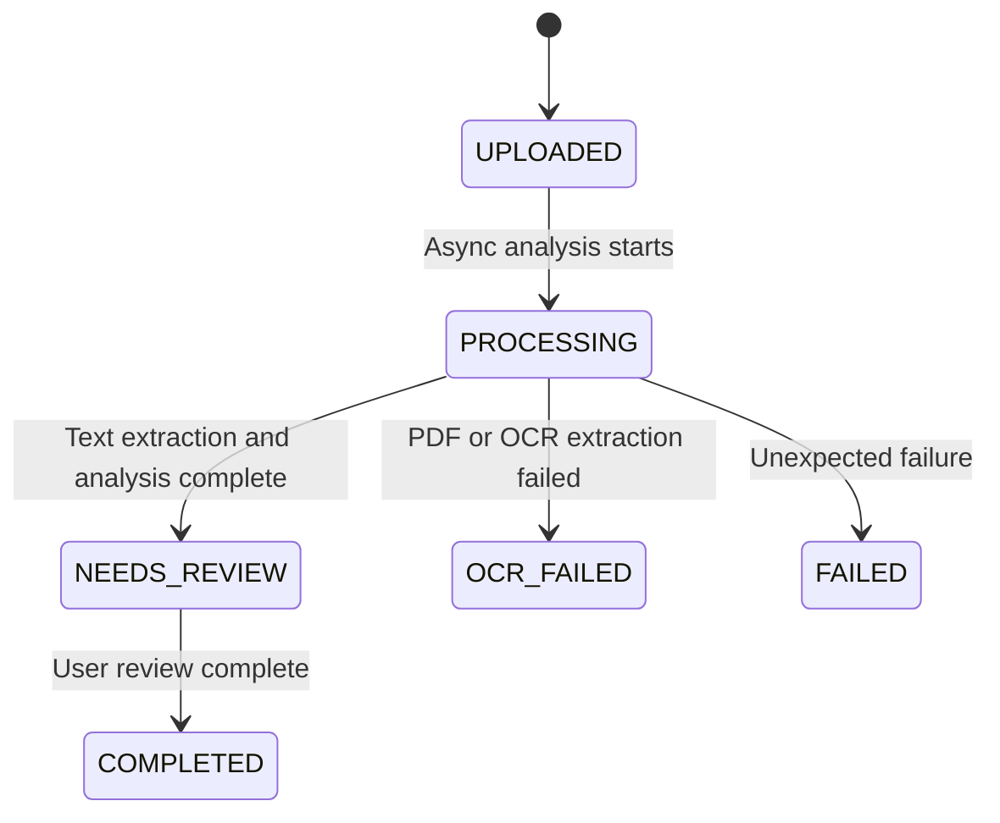

# Architecture

This document describes the current backend MVP architecture.

## Package Overview

```text
com.docuaction
  action      - document-generated actions and action lifecycle
  analysis    - async analysis jobs, text extraction, mock AI analysis
  auth        - signup, login, JWT issuing
  common      - response, exception, security, health
  document    - upload, query, review, logical deletion
  file        - local file storage
  user        - user entity and current user API
```

## High-Level Flow



## Upload And Analysis Sequence



## Review And Action Generation Sequence



## Action Lifecycle



## Document Lifecycle



## Current MVP Boundaries

- Text extraction uses pluggable providers.
- PDF text extraction is real and uses Apache PDFBox.
- Image OCR currently uses an unsupported-image provider that fails clearly until a real OCR provider is configured.
- AI analysis defaults to `MockAiAnalysisService`.
- OpenAI integration can be enabled with `DOCUACTION_AI_PROVIDER=openai` and `OPENAI_API_KEY`.
- OCR and AI analysis steps write usage logs for provider, status, duration, payload size, and error details.
- Local H2 is used for MVP development.
- Uploaded files are stored locally under `backend/storage/documents`.
- Document deletion is logical. Original files are retained in MVP.

## Next Architecture Changes

- Add provider-level usage logs and cost estimates.
- Add image OCR provider integration.
- Move from local storage to S3-compatible private object storage.
- Replace `@Async` with a persistent job worker or queue when needed.
