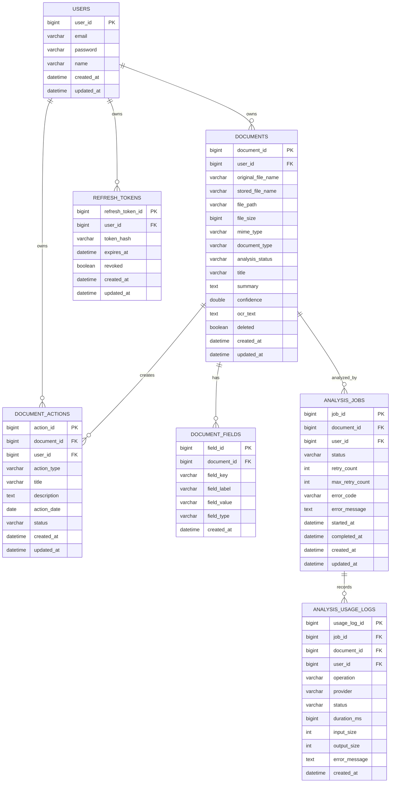

# ERD

This ERD represents the current backend MVP schema generated from the JPA entities.

## Notes

- `documents.deleted` supports logical deletion.
- `refresh_tokens.token_hash` stores a hash of the opaque refresh token, not the original token value.
- `document_fields` stores user-reviewable extracted values.
- `analysis_jobs` records the async analysis lifecycle.
- `analysis_usage_logs` records OCR/AI provider usage, duration, payload size, and failure details.
- `document_actions` stores reminders and expense records generated after user review.
- Dynamic extracted values are stored as field rows rather than fixed columns to support multiple document types.

